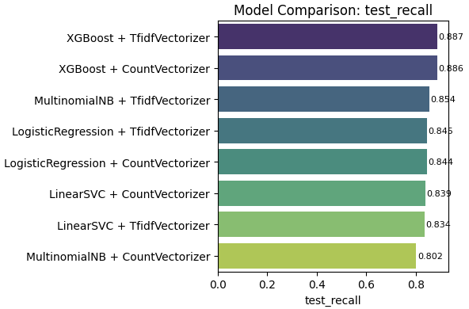

# Project documentation

This document provides the documentation for the Sentiment Analysis of Tweets project during the NLP course at FHNW. The different approaches and models used in this project are described in theoretical terms and the results are presented in a structured manner.

## Data Analysis

In this project the "Large-Twitter-Tweets-Sentiment" Dataset has been used, which is available on [Hugging Face](https://huggingface.co/datasets/gxb912/large-twitter-tweets-sentiment).

The dataset consists of tweets that have been labeled positive or negative. The dataset is divided into a training set and a test set, the training set contains 179'995 rows, the test set contains 44'999 rows. Each row contains a tweet and its corresponding label (1 = positive, 0 = negative).

In both the training and test set, the positive sentiment has a higher representation than the negative sentiment. The training set contains 57.8488% positive and 42.1512% negative tweets, while the test set contains 57.8502% positive and 42.1498% negative tweets.

> The source code for the data analysis can be found in the [dataAnalysis.ipynb](data/dataAnalysis.ipynb) notebook.

## Metrics

To evaluate the model-performance, the following metrics are used:

* **Precision**: The ratio of true positive predictions to the total number of positive predictions.

  

    
  

* **Recall**: The ratio of true positive predictions to the total number of actual positive instances.

    

      
    

* **F1-Score**: The harmonic mean of precision and recall, providing a balance between the two metrics.

    

      
    

* **Training Time**: The time taken to train the model on the training dataset.

* **Inference Time**: The time taken to make predictions on the test dataset.

## Models

### Bag-of-Words

#### Theoretical Background

Bag-of-Words (BoW) is a simple text representation which relies on the frequency of words in a document. In this model, each document is represented as a vector of word counts, ignoring the order of words (sparse vector representation). To use a BoW representation for sentiment analysis, the vecorized words are fed into a machine learning model, such as logistic regression or Naive Bayes, to classify the sentiment of the document.

#### Implementation

The Bag-of-Words (BoW) implementation in this project uses two different vectorization techniques:

* **Count Vectorization**: This technique counts the number of occurrences of each word in the document and creates a sparse matrix representation.

* **TF-IDF Vectorization**: This technique computes the term frequency-inverse document frequency (TF-IDF) score for each word in the document, assigning higher weights to terms that are more informative for a specific document relative to the entire corpus.

The model is then trained using various machine learning algorithms:

* **Naive Bayes**: A probabilistic classifier based on Bayes' theorem. It assumes that the features  are conditionally independent given the class label . The predicted class is the one that maximizes the posterior probability:
  
  

    
  

* **Logistic Regression**: A linear model that uses the sigmoid   (logistic function) to model the probability of a binary outcome. The probability of a tweet being positive is calculated  as:
  
  

    
  

    where  is the weight vector,  is the feature vector, and  is the bias term.

* **Linear Support Vector Machine (SVM)**: A linear classifier that identifies the hyperplane which maximizes the margin between classes in the feature space. The model is trained using the hinge loss function:

  

    
  

  where  is the true label,  is the predicted score, and  is the feature vector.

* **XGBoost**: An optimized gradient boosting algorithm that uses decision trees as base learners. Each new tree is trained to minimize a regularized objective function, improving the model’s predictive accuracy while preventing overfitting. The objective at iteration  is:
  
  

    
  

  
  where  is a loss function (e.g., logistic loss),
   is the new decision tree, and
   is a regularization term penalizing model complexity.

#### Results

The in the previous section described models were trained on the training set and evaluated on the test set. Each model was tested with both vectorization techniques (Count Vectorization and TF-IDF Vectorization).

##### Precision

The highest test precision was achived using a count vectorizer and a Multinomial Naive Bayes model. The precision of the different models ranged from 0.720 and 0.788.

##### Recall

The highest test recall was achived with a TF-IDF vectorizer and XGBoost model.
The recall of the different models ranged from 0.802 and 0.887.

##### F1-Score

The highest f1-score was achived with a TF-IDF vectorizer and Logistic Regression model. The f1-score of the different models ranged from 0.795 and 0.808.

##### Training Time

TODO Text

##### Inference Time

TODO Text

##### Summary

Among all tested configurations:

* Multinomial Naive Bayes with Count Vectorization achived the highest precision.
* XGBoost with TF-IDF Vectorization achived the highest recall.
* Logistic Regression with TF-IDF Vectorization achived the highest f1-score.

Considering the trade-off between precision, recall and f1-score, the Logistic Regression model with TF-IDF Vectorization can be considered the most effective overall for this Bag-of-Words based sentiment classification task.

> The source code for the Bag-of-Words model can be found in the [bagOfWords.ipynb](models/bagOfWords.ipynb) notebook.

### Elastic Net

#### Theoretical Background

Elastic Net is a linear regression model that combines the penalties of Lasso (L1) and Ridge (L2) regression. This combination allows the model to retain the advantages of both regularization techniques: Sparse feature Selection (L1) and stability under multicollinearity (L2). In the context of logistic regression, Elastic Net helps to prevent overfitting in high-dimensional feature spaces, such as those created by text vectorization techniques like Bag-of-Words.

#### Implementation

As in the Bag-of-Words model, the Elastic Net model is trained using two different vectorization techniques:

* **Count Vectorization**
* **TF-IDF Vectorization**

As a classifier, the SGDClassifier with Elastic Net regularization is used.
The SGDClassifier is a linear classifier that uses stochastic gradient descent to optimize the model parameters. The Elastic Net regularization is applied to the loss function, which combines the L1 and L2 penalties.

After identifying the Count Vectorization as the slightly better performing vectorization technique, the hyperparameters of the SGDClassifier were tuned using a grid search with cross-validation. The best hyperparameters were found to be:

* **alpha**: 0.0001
* **l1_ratio**: 0.15
* **penalty**: 'l2'

This means that the model uses a combination of L1 and L2 regularization, with a stronger emphasis on L2 regularization.

#### Results

The Elastic Net model was trained on the training set and evaluated on the test set using both vectorization techniques.

##### Precision

The highest test precision was achived with a Count Vectorizer and SGDClassifier, and with the tuned hyperparameters. The precision of the different models ranged from 0.752 and 0.764.

##### Recall

The highest test recall wias achived with the Count Vectorizer and the SGDClassifier. The model with the tuned hyperparameters achived a recall slightly lower than the model with the default hyperparameters. The recall of the different models ranged from 0.852 and 0.867.

##### F1-Score

The highest f1-score was achived with the Count Vectorizer and the SGDClassifier, without tuning the hyperparameters. The f1-score of the different models ranged from 0.799 and 0.812.

##### Training Time

TODO Text

##### Inference Time

TODO Text

##### Summary

Among all tested configurations, the Count Vectorizer proved to be the better performing vectorization technique. The differences between the models were not significant, tuning the hyperparameters of the SGDClassifier did not lead to a significant improvement in performance. The best performing model was the SGDClassifier with Count Vectorization, achieving a precision of 0.764, a recall of 0.867 and an f1-score of 0.812.

> The source code for the Elastic Net model can be found in the [elasticNet.ipynb](models/elasticNet.ipynb) notebook.

### Random Forest

#### Theoretical Background

TODO Text

#### Implementation

TODO Text

#### Results

TODO Text

> The source code for the Random Forest model can be found in the [randomForest.ipynb](models/randomForest.ipynb) notebook.

### Recurrent Neural Network

#### Theoretical Background

TODO Text

#### Implementation

TODO Text

#### Results

TODO Text

> The source code for the Recurrent Neural Network model can be found in the [rnn.ipynb](models/rnn.ipynb) notebook.

### LSTM

#### Theoretical Background

Long Short-Term Memory (LSTM) networks are a type of recurrent neural network (RNN) designed to capture long-range dependencies in sequential data. Unlike traditional RNNs, LSTMs use a gated architecture to control the flow of information and reduce the vanishing gradient problem. This makes them particularly effective for natural language processing tasks where context and order are important, such as text classification, machine translation, or sentiment analysis.

#### Implementation

We implemented an LSTM-based sentiment classifier using Keras. Text data was preprocessed using Keras' Tokenizer, which converted raw text into padded integer sequences. Sentiment labels were encoded using LabelEncoder. The LSTM model consisted of an embedding layer, a single LSTM layer, and two dense layers with dropout for regularization.

The model was trained on an NVIDIA RTX A6000 GPU for 10 epochs. The following key components were used:

* Embedding size: 64
* LSTM units: 64
* Dropout: 0.5 after LSTM and Dense layers
* Final activation: Sigmoid (for binary classification)
* Batch size: 32
* Epochs: 10

#### Results

The LSTM model was trained on the training set and evaluated on both validation and test sets. The results indicate stable and consistent performance across all key metrics.

##### Precision

The test precision reached 0.783, demonstrating the model's effectiveness in minimizing false positives.

##### Recall

A test recall of 0.785 indicates the model successfully identified the majority of true positive cases in the dataset.

##### F1-Score

With a test F1-score of 0.784, the model shows a balanced trade-off between precision and recall, which is crucial in sentiment classification.

##### Training Time

The total training duration was approximately 206 seconds (~3.4 minutes) on an NVIDIA RTX A6000 GPU.

##### Inference Time

The model completed inference in approximately 1.76 seconds.

> The source code for the LSTM model can be found in the [lstm.ipynb](models/lstm.ipynb) notebook.

### BERT

#### Theoretical Background

BERT (Bidirectional Encoder Representations from Transformers) is a transformer-based language model introduced by Google. Unlike previous models that processed text either left-to-right or right-to-left, BERT uses a deeply bidirectional approach by masking words in the input and training the model to predict them based on both left and right context. This allows BERT to learn more nuanced representations of language. Pretrained on large corpora such as Wikipedia and BooksCorpus, BERT has significantly advanced performance across a wide range of NLP tasks, including question answering, sentiment analysis, and named entity recognition.

#### Implementation

For implementation, we used the pretrained `bert-base-uncased` model from Hugging Face's Transformers library. The model was fine-tuned on our specific dataset for downstream tasks. Tokenization was handled using BERT's WordPiece tokenizer, and the final layer was adapted to our classification objective. The training process was managed using Hugging Face's `Trainer` API with `TrainingArguments`. Key settings included a small number of epochs, warmup steps to stabilize early training, and automatic logging and evaluation at each epoch. The best model was selected based on the F1 score.

* Epochs: 3
* Train Batch Size: 16
* Eval Batch Size: 64

#### Results

The bert-base-uncased model was fine-tuned on the training set and evaluated on both validation and test sets. Evaluation metrics include accuracy, precision, recall, and F1-score. The model was trained on an NVIDIA RTX A6000 GPU.

##### Precision

The model achieved strong precision scores on both validation and test sets, with the highest test precision reaching 0.844. This indicates that the model effectively minimizes false positives in classification.

##### Recall

Recall was also high, especially on the test set, where the model achieved a score of 0.879. This suggests that the model is successful in identifying the majority of true positive cases.

##### F1-Score

The F1-score balances precision and recall, and the BERT model achieved a robust F1-score of 0.861 on the test set, demonstrating consistent and reliable classification performance.

##### Training Time

The training process took approximately 2904 seconds (~48 minutes), using an NVIDIA RTX A6000 GPU. This enabled efficient fine-tuning of the large transformer model.

##### Inference Time

TODO Text

##### Summary

The fine-tuned bert-base-uncased model demonstrated high performance across all evaluation metrics. On the test set, it achieved:

* Precision: 0.844
* Recall: 0.879
* F1-score: 0.861

These results confirm that BERT is highly effective for the downstream classification task. While training time is relatively high, the use of an A6000 GPU helped reduce computational bottlenecks and made the training process feasible for large-scale models.

> The source code for the BERT model can be found in the [bert.ipynb](models/bert.ipynb) notebook.

## Discussion
