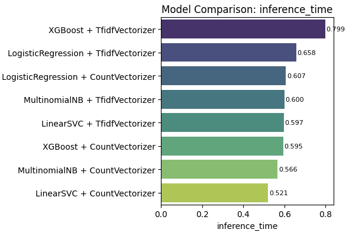
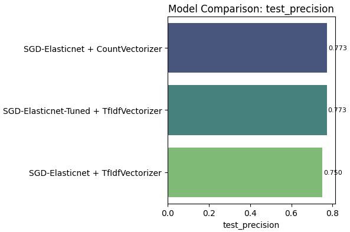
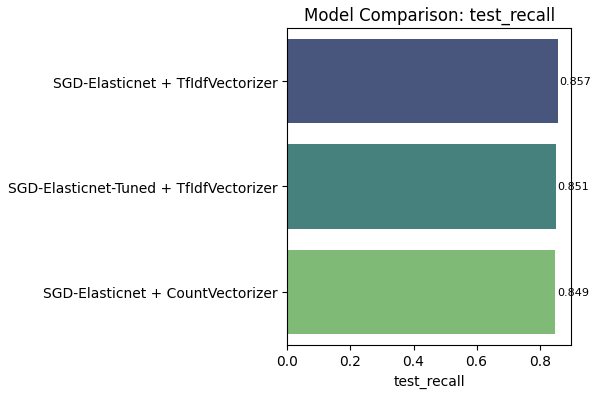
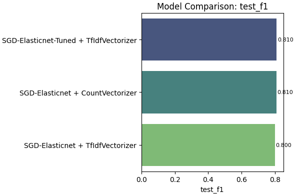
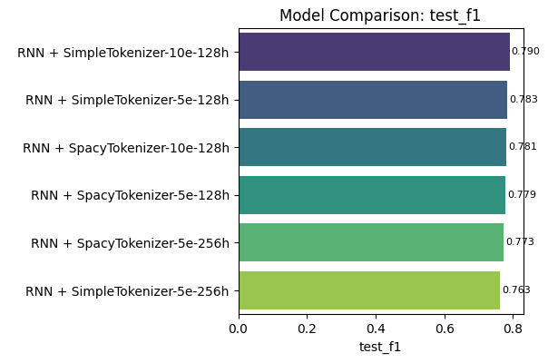

# Project documentation

This document provides the documentation for the Sentiment Analysis of Tweets project during the NLP course at FHNW. The different approaches and models used in this project are described in theoretical terms and the results are presented in a structured manner.

## Data Analysis

In this project the "Large-Twitter-Tweets-Sentiment" Dataset has been used, which is available on [Hugging Face](https://huggingface.co/datasets/gxb912/large-twitter-tweets-sentiment).

The dataset consists of tweets that have been labeled positive or negative. The dataset is divided into a training set and a test set, the training set contains 179'995 rows, the test set contains 44'999 rows. Each row contains a tweet and its corresponding label (1 = positive, 0 = negative).

In both the training and test set, the positive sentiment has a higher representation than the negative sentiment. The training set contains 57.8488% positive and 42.1512% negative tweets, while the test set contains 57.8502% positive and 42.1498% negative tweets.

> The source code for the data analysis can be found in the [dataAnalysis.ipynb](data/dataAnalysis.ipynb) notebook.

## Metrics

To evaluate the model-performance, the following metrics are used:

* **Precision**: The ratio of true positive predictions to the total number of positive predictions.

  

    
  

* **Recall**: The ratio of true positive predictions to the total number of actual positive instances.

    

      
    

* **F1-Score**: The harmonic mean of precision and recall, providing a balance between the two metrics.

    

      
    

* **Training Time**: The time taken to train the model on the training dataset.

* **Inference Time**: The time taken to make predictions on the test dataset.

## Models

### Bag-of-Words

#### Theoretical Background

Bag-of-Words (BoW) is a simple text representation which relies on the frequency of words in a document. In this model, each document is represented as a vector of word counts, ignoring the order of words (sparse vector representation). To use a BoW representation for sentiment analysis, the vecorized words are fed into a machine learning model, such as logistic regression or Naive Bayes, to classify the sentiment of the document.

#### Implementation

The Bag-of-Words (BoW) implementation in this project uses two different vectorization techniques:

* **Count Vectorization**: This technique counts the number of occurrences of each word in the document and creates a sparse matrix representation.

* **TF-IDF Vectorization**: This technique computes the term frequency-inverse document frequency (TF-IDF) score for each word in the document, assigning higher weights to terms that are more informative for a specific document relative to the entire corpus.

The model is then trained using various machine learning algorithms:

* **Naive Bayes**: A probabilistic classifier based on Bayes' theorem. It assumes that the features  are conditionally independent given the class label . The predicted class is the one that maximizes the posterior probability:
  
  

    
  

* **Logistic Regression**: A linear model that uses the sigmoid   (logistic function) to model the probability of a binary outcome. The probability of a tweet being positive is calculated  as:
  
  

    
  

    where  is the weight vector,  is the feature vector, and  is the bias term.

* **Linear Support Vector Machine (SVM)**: A linear classifier that identifies the hyperplane which maximizes the margin between classes in the feature space. The model is trained using the hinge loss function:

  

    
  

  where  is the true label,  is the predicted score, and  is the feature vector.

* **XGBoost**: An optimized gradient boosting algorithm that uses decision trees as base learners. Each new tree is trained to minimize a regularized objective function, improving the model’s predictive accuracy while preventing overfitting. The objective at iteration  is:
  
  

    
  

  
  where  is a loss function (e.g., logistic loss),
   is the new decision tree, and
   is a regularization term penalizing model complexity.

#### Results

The in the previous section described models were trained on the training set and evaluated on the test set. Each model was tested with both vectorization techniques (Count Vectorization and TF-IDF Vectorization).

##### Precision

The highest test precision was achived using a count vectorizer and a Multinomial Naive Bayes model. The precision of the different models ranged from 0.721 and 0.788.

##### Recall

The highest test recall was achived with a TF-IDF vectorizer and XGBoost model.
The recall of the different models ranged from 0.802 and 0.887.

##### F1-Score

The highest f1-score was achived with a TF-IDF vectorizer and Logistic Regression model. The f1-score of the different models ranged from 0.795 and 0.808.

##### Training Time

The training time varies significantly between the different models. The Linear SVM model with Count Vectorization took the longest time to train (40 seconds), while the Multinomial Naive Bayes model with TF-IDF Vectorization was the fastest (2.2 seconds). The models were trained on NVIDIA Quadro P5000 GPU.

##### Inference Time

The inference time varies between the different models, but is generally low. The Linear SVM model with Count Vectorization has the lowest inference time (0.521 seconds), while the XGBoost model with TF-IDF Vectorization has the highest inference time (0.799 seconds).

##### Summary

Among all tested configurations:

* Multinomial Naive Bayes with Count Vectorization achived the highest precision.
* XGBoost with TF-IDF Vectorization achived the highest recall.
* Logistic Regression with TF-IDF Vectorization achived the highest f1-score.

Considering the trade-off between precision, recall and f1-score, the Logistic Regression model with TF-IDF Vectorization can be considered the most effective overall for this Bag-of-Words based sentiment classification task.

> The source code for the Bag-of-Words model can be found in the [bagOfWords.ipynb](models/bagOfWords.ipynb) notebook.

### Elastic Net

#### Theoretical Background

Elastic Net is a linear regression model that combines the penalties of Lasso (L1) and Ridge (L2) regression. This combination allows the model to retain the advantages of both regularization techniques: Sparse feature Selection (L1) and stability under multicollinearity (L2). In the context of logistic regression, Elastic Net helps to prevent overfitting in high-dimensional feature spaces, such as those created by text vectorization techniques like Bag-of-Words.

#### Implementation

As in the Bag-of-Words model, the Elastic Net model is trained using two different vectorization techniques:

* **Count Vectorization**
* **TF-IDF Vectorization**

As a classifier, the SGDClassifier with Elastic Net regularization is used.
The SGDClassifier is a linear classifier that uses stochastic gradient descent to optimize the model parameters. The Elastic Net regularization is applied to the loss function, which combines the L1 and L2 penalties.

After identifying the Count Vectorization as the slightly better performing vectorization technique, the hyperparameters of the SGDClassifier were tuned using a grid search with cross-validation. The best hyperparameters were found to be:

* **alpha**: 0.0001
* **l1_ratio**: 0.15
* **penalty**: 'l2'

This means that the model uses a combination of L1 and L2 regularization, with a stronger emphasis on L2 regularization.

#### Results

The Elastic Net model was trained on the training set and evaluated on the test set using both vectorization techniques.

##### Precision

The highest test precision was achived with a Count Vectorizer and SGDClassifier, and with the tuned hyperparameters. The precision of the different models ranged from 0.750 and 0.773.

##### Recall

The highest test recall wias achived with the Count Vectorizer and the SGDClassifier. The model with the tuned hyperparameters achived a recall slightly lower than the model with the default hyperparameters. The recall of the different models ranged from 0.849 and 0.857.

##### F1-Score

The highest f1-score was achived with the Count Vectorizer and the SGDClassifier and the TF-IDF Vectorizer with a tuned SGDClassifier. The f1-score of the different models ranged from 0.8 and 0.81.

##### Training Time

The training time of the different models show no significant differences and are close to the fastest model of the Bag-of-Words approach. This makes sense, as the models are close to the Bag-of-Words models, but with a different regularization technique. The models were trained on NVIDIA Quadro P5000 GPU.

##### Inference Time

The inference time is in a similar range as the inference time of the Bag-of-Words models, below one second for all models.

##### Summary

Among all tested configurations, the Count Vectorizer proved to be the better performing vectorization technique. The differences between the models were not significant, tuning the hyperparameters of the SGDClassifier did not lead to a significant improvement in performance. The best performing model was the SGDClassifier with Count Vectorization, achieving a precision of 0.773, a recall of 0.857 and an f1-score of 0.81.

> The source code for the Elastic Net model can be found in the [elasticNet.ipynb](models/elasticNet.ipynb) notebook.

### Random Forest

#### Theoretical Background

Random Forest is an ensemble learning method that constructs multiple decision trees during training and outputs the mode of their predictions for classification tasks. It is particularly effective for handling high-dimensional data and can capture complex interactions between features. Random Forest mitigates overfitting by averaging the predictions of individual trees, which reduces variance and improves generalization.
The model is trained using a subset of features and samples, which helps to create diverse trees. The final prediction is made by aggregating the predictions from all trees, typically using majority voting for classification tasks.

#### Implementation

Like in the previous experiments, the Random Forest model is trained using two different vectorization techniques:

* **Count Vectorization**
* **TF-IDF Vectorization**

The Random Forest model is implemented using the `RandomForestClassifier` from the `sklearn.ensemble` module. The model is trained on the training set and evaluated on the test set using both vectorization techniques.
The hyperparameters of the Random Forest model were tuned using a grid search with cross-validation. The best hyperparameters were found to be:

* **class_weight**: 'balanced'
* **max_depth**: 50
* **max_features**: 'sqrt'
* **min_samples_leaf**: 1
* **min_samples_split**: 2
* **n_estimators**: 200

This means that the model uses a balanced class weight, a maximum depth of 50, a maximum of sqrt features for each split, a minimum of 1 sample per leaf and a minimum of 2 samples to split an internal node. The number of trees in the forest is set to 200.

#### Results

##### Precision

The finetuned Random Forest model with TF-IDF Vectorization achived the highest test precision of 0.784. The other models achived a significantly lower precision, with the Random Forest model with Count Vectorization achieving the lowest precision of 0.58.

##### Recall

The Random Forest model with Count Vectorization achived a recall of 1.0, the Random Forest model with TF-IDF vectorization achieved similar high recall of 0.963. The finetuned model however achived a significantly lower recall of 0.775.

##### F1-Score

The finetuned Random Forest model with TF-IDF Vectorization achieved the highest f1-score of 0.78. The other models achived similar f1-scores.

##### Training Time

The training time of the finetuned model is significantly higher, taking over a minute. The other models were trained in 14.6 respectively 7.6 seconds. Seing as the finetuned model is trained with 200 trees, increased training time is expected.  The models were trained on NVIDIA Quadro P5000 GPU.

##### Inference Time

The inference time of the finetuned model is a half a second slower (1.567 seconds) than the fastest model, which is the Random Forest model with Count Vectorization (0.979 seconds).

##### Summary

The experiments compared three different configurations of a Random Forest classifier for sentiment analysis, varying in both the vectorization technique and the extent of hyperparameter tuning. The evaluation considered multiple criteria including precision, recall, F1-score, training time, and inference time.

* The finetuned Random Forest model with TF-IDF Vectorization achieved the highest precision (0.784) and F1-score (0.78), indicating a strong balance between true positive rate and false positive rate.
* The Random Forest model with Count Vectorization achieved the highest recall (1.0), but at the cost of lower precision (0.58), suggesting it may be overly sensitive to positive cases.
* The finetuned model's training time was significantly longer (over a minute) compared to the other models, which were trained in under 15 seconds. This reflects the increased complexity of training 200 trees with tuned hyperparameters.
* Inference times were generally low, with the finetuned model taking 1.567 seconds, which is acceptable for many real-time applications.

Overall, the finetuned Random Forest model with TF-IDF Vectorization is the most effective configuration for sentiment analysis in this context, achieving a good balance of precision, recall, and F1-score while maintaining reasonable inference times. The increased training time can be justified by the improved precision.

> The source code for the Random Forest model can be found in the [randomForest.ipynb](models/randomForest.ipynb) notebook.

### Recurrent Neural Network

#### Theoretical Background

Recurrent Neural Networks (RNNs) are designed to process sequential data by retaining information from previous inputs through their hidden states. This architecture makes RNNs especially well-suited for tasks where the order and context of the data are crucial — for example, text sentiment analysis, speech recognition, or time-series forecasting.

While RNNs are powerful for modeling sequential dependency, their ability to retain information degrades over long sequences due to the vanish­ing gradient problem. This makes them less effective for very long-range dependency, in contrast to LSTMs, which incorporate additional mechanisms (like gates) to aid in retaining information. Nevertheless, RNNs remain a strong and lightweight baseline for many applications, and can perform well when the sequences are not excessively long.

#### Implementation

The implemented RNN models were constructed using PyTorch. The first approach utilizes a simple tokenizer, which converts text to lower case, removes punctuation, and splits the text into tokens. We performed limited hyperparameter tuning by trying different combinations for the number of epochs and the size of the hidden layer.

The second approach utilizes a more sophisticated spaCy tokenizer. This pipeline performs lemmatization and removal of stop words and punctuation. Furthermore, GloVe embeddings were used to provide semantic information to the network, allowing it to better understand relationships between words.

The main architecture for both methods comprises the following components:

* **Embedding Layer:** Translates each word index into a dense vector representation. In the GloVe-based approach, these embeddings are initialized with pre-trained GloVe vectors and can be fine-tuned during training.
* **RNN Layer:** An optional multi-layer, bidirectional RNN processes the sequence of word embeddings, retaining context through its hidden states.
* **Dropout Layer:** Dropout is applied to aid in reducing overfitting by randomly turning off a percentage of neurons during training.
* **Fully Connected Layer:** The final hidden state (or concatenation of forward and backward states in the bidirectional case) is fed into a fully connected layer, projecting it down to the output dimension (typically 1 for binary sentiment classification).

#### Results

##### Precision

The precision of the RNN models on the test set falls within a range from 0.767 to 0.791. The highest precision was delivered by the RNN with the simple tokenizer, trained for 10 epochs with a hidden layer size of 128.

##### Recall

The recall for the RNN models shows a range from 0.767 to 0.79. The highest recall was also demonstrated by the RNN with the simple tokenizer, trained for 10 epochs with a hidden layer size of 128.

##### F1-Score

The F1-score for the RNN models falls within 0.763 – 0.79. The highest F1-score, reflecting the balance between precision and recall, was produced by the RNN with a simple tokenizer (10 epochs, hidden_dim = 128).

##### Training Time

Training time for the RNN models was significantly influenced by the number of epochs and the size of the hidden layer. The models trained for 10 epochs naturally took much longer, with the simple tokenizer (10 epochs, hidden_dim = 128) requiring nearly 398 seconds. Overall, training with the simple tokenizer was somewhat slower than with the spaCy tokenizer. The models were trained on an NVIDIA RTX A6000 GPU.

##### Inference Time

Inference time for the RNN models range from approximately 2.85 seconds to 3.49 seconds, with the simple tokenizer (10 epochs, hidden_dim = 128) delivering the fastest performance.

##### Summary

Overall, the RNN models performed comparably to their LSTM counterparts, delivering strong precision, recall, and F1-scores — all within a range of 0.767–0.79. The highest-performing configuration was the RNN with a simple tokenizer, trained for 10 epochs with a hidden layer size of 128.

While the spaCy tokenizer brings additional semantic depth to the inputs, it did not outperform the simpler tokenizer in this setting. This suggests that additional complexity may not translate to improved performance for this particular task. The simple RNN, meanwhile, strikes a strong balance between performance and training speed.

> The source code for the Recurrent Neural Network model can be found in the [rnn.ipynb](models/rnn.ipynb) notebook.

### LSTM

#### Theoretical Background

Long Short-Term Memory (LSTM) networks are a type of recurrent neural network (RNN) designed to capture long-range dependencies in sequential data. Unlike traditional RNNs, LSTMs use a gated architecture to control the flow of information and reduce the vanishing gradient problem. This makes them particularly effective for natural language processing tasks where context and order are important, such as text classification, machine translation, or sentiment analysis.

#### Implementation

Various LSTM-models were implemented using the pyTorch library. The first, simpler approach uses a simple tokenizer, which lowers the text, removes punctuation and splits the text on whitespaces into tokens. Limited hyperparameter tuning was performed, where various configurations for the number of epochs and the hidden layer size were tested.

The second approach uses a more complex spaCy tokenizer, which tokenizes the text, removes stop words and punctuation, and lemmatizes the tokens. Additionaly, a GloVe embedding layer is used to initialize the word embeddings. GloVe (Global Vectors for Word Representation) is a pre-trained word embedding model that captures semantic relationships between words based on their co-occurrence in large text corpora. This helps to capture the meaning of words in a context. For example, the word "good" and "great" would have similar embeddings, as they are often used in similar contexts.

The core model used in both approaches is an LSTM-based sentiment classifier implemented in PyTorch. The model consists of the following components:

* **Embedding Layer**: Maps each word index to a dense vector representation. In the GloVe-based model, this layer is initialized with pre-trained GloVe embeddings and can be optionally frozen or fine-tuned.
* **LSTM Layer**: A multi-layer, optionally bidirectional Long Short-Term Memory (LSTM) network processes the sequence of word embeddings. This layer captures sequential and contextual information from the input text.
* **Dropout Layer**: Dropout is applied to the embeddings and hidden states to reduce overfitting.
* **Fully Connected Layer**: The final hidden state (or concatenation of the last forward and backward states in the bidirectional case) is passed through a fully connected linear layer that projects it to the output dimension (typically 1 for binary sentiment classification).
* **Output**: The model outputs a single value per input, which is typically passed through a sigmoid function to represent the probability of a positive sentiment.

#### Results

##### Precision

The precision of the LST models on the test set is in a small range between 0.798 and 0.808. The highest precision delivered the LST model with the simple tokenizer with 10 epochs and a hidden layer size of 128.

##### Recall

As with the precision, the recall of the LSTM models is in a small range between 0.798 and 0.808. Again, the highest recall delivered the LSTM model with the simple tokenizer with 10 epochs and a hidden layer size of 128.

##### F1-Score

The F1-score of the LSTM models is in a small range between 0.798 and 0.808. The highest F1-score delivered the LSTM model with the simple tokenizer with 10 epochs and a hidden layer size of 128.

##### Training Time

Models with 10 epochs take significantly longer to train than models with 5 epochs, which is expected. Generally speaking, the training with the simple tokenizer is slower than the training with the spaCy tokenizer.  The models were trained on NVIDIA Quadro P5000 GPU.

##### Inference Time

The inference time ranges from 3.943 seconds to 5.717 seconds, with the model with the simple tokenizer, 10 epochs and a hidden layer size of 128 being the fastest.

##### Summary

The results indicate, that all LSTM models, regardless of tokenizer choice and hyperparameters, achieved similar performance metrics. The models consistently delivered precision, recall, and F1-scores around 0.8, indicating a solid classification capability for sentiment analysis tasks. The highest-performing model was the LSTM with a simple tokenizer, trained for 10 epochs with a hidden layer size of 128.

While the spaCy tokenizer, combined with GloVe embeddings, brings linguistic richness and semantic depth to the input, it did not outperform the simpler tokenizer in this specific setup. This suggests that the additional complexity of the spaCy tokenizer and GloVe embeddings may not have provided a significant advantage for this particular dataset and task.

In terms of training time, models trained for 10 epochs naturally took longer, with the simple tokenizer models leading to slightly higher durations compared to the spaCy tokenizer.

> The source code for the LSTM model can be found in the [lstm.ipynb](models/lstm.ipynb) notebook.

### BERT

#### Theoretical Background

BERT (Bidirectional Encoder Representations from Transformers) is a transformer-based language model introduced by Google. Unlike previous models that processed text either left-to-right or right-to-left, BERT uses a deeply bidirectional approach by masking words in the input and training the model to predict them based on both left and right context. This allows BERT to learn more nuanced representations of language. Pretrained on large corpora such as Wikipedia and BooksCorpus, BERT has significantly advanced performance across a wide range of NLP tasks, including question answering, sentiment analysis, and named entity recognition.

#### Implementation

For implementation, we used the pretrained `bert-base-uncased` model from Hugging Face's Transformers library. The model was fine-tuned on our specific dataset for downstream tasks. Tokenization was handled using BERT's WordPiece tokenizer, and the final layer was adapted to our classification objective. The training process was managed using Hugging Face's `Trainer` API with `TrainingArguments`. Key settings included a small number of epochs, warmup steps to stabilize early training, and automatic logging and evaluation at each epoch. The best model was selected based on the F1 score.

* Epochs: 3
* Train Batch Size: 16
* Eval Batch Size: 64

#### Results

The bert-base-uncased model was fine-tuned on the training set and evaluated on both validation and test sets. Evaluation metrics include accuracy, precision, recall, and F1-score. The model was trained on an NVIDIA RTX A6000 GPU.

##### Precision

The model achieved strong precision scores on both validation and test sets, with the highest test precision reaching 0.844. This indicates that the model effectively minimizes false positives in classification.

##### Recall

Recall was also high, especially on the test set, where the model achieved a score of 0.879. This suggests that the model is successful in identifying the majority of true positive cases.

##### F1-Score

The F1-score balances precision and recall, and the BERT model achieved a robust F1-score of 0.861 on the test set, demonstrating consistent and reliable classification performance.

##### Training Time

The training process took approximately 2904 seconds (~48 minutes), using an NVIDIA RTX A6000 GPU. This enabled efficient fine-tuning of the large transformer model.

##### Inference Time

The model completed inference in approximately 57.7272 seconds.

##### Summary

The fine-tuned bert-base-uncased model demonstrated high performance across all evaluation metrics. On the test set, it achieved:

* Precision: 0.844
* Recall: 0.879
* F1-score: 0.861

These results confirm that BERT is highly effective for the downstream classification task. While training time is relatively high, the use of an A6000 GPU helped reduce computational bottlenecks and made the training process feasible for large-scale models.

> The source code for the BERT model can be found in the [bert.ipynb](models/bert.ipynb) notebook.

## Discussion

In this project, we explored various approaches for a sentiment analysis using twitter data. Each model was evaluated on precision, recall, F1-score, training time and inference time. The training and inference times were measured on different graphics cards due to execution restrictions on our rented GPU, which may affect the comparability of these metrics.

The table below summarizes the performance of the best performing model for each approach:

| Model                                                         | Precision | Recall | F1    | Training Time [s] | Inference Time for Test-Set [s] |
| ------------------------------------------------------------- | --------- | ------ | ----- | ----------------- | ------------------------------- |
| Baseline (Count Vectorizer, Multinomial NB)                | 0.76      | 0.76   | 0.76  | 3.74              | 1.014                           |
| Bag of Words (TF-IDF Vectorizer, Logistic Regression)      | 0.775     | 0.845  | 0.808 | 8.16              | 0.658                           |
| Elastic Net (Count Vectorizer, SGD-Elasticnet Classifier)  | 0.773     | 0.857  | 0.81  | 3.614             | 0.83                            |
| Random Forest (TF-IDF Vectorizer, with Finetuning)         | 0.784     | 0.775  | 0.78  | 61.615            | 1.567                           |
| Recurrent Neural Network                                      | 0.79      | 0.79   | 0.79  | 398               | 2.83                            |
| LSTM (Simple tokenizer, 10 epochs, hidden layer of 128)    | 0.808     | 0.808  | 0.808 | 672.625           | 3.943                           |
| BERT                                                          | 0.844     | 0.879  | 0.861 | 2904              | 57.727                          |

Most of the models were able to surpass the baseline model, however often with a marginal improvement. The BERT model achived the best performance in terms of precision, recall and F1-score, but also required the most training time and inference time.
